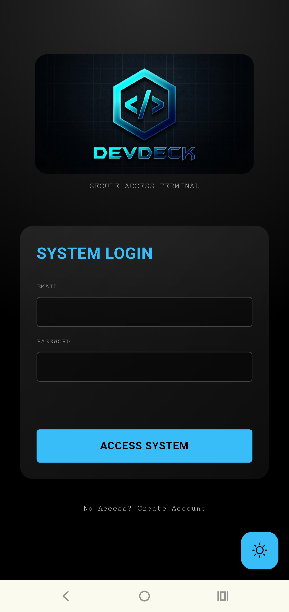
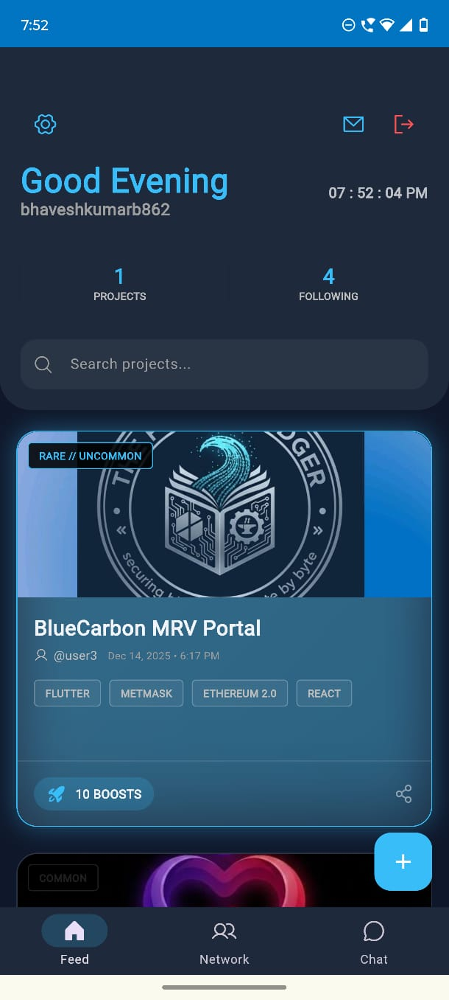
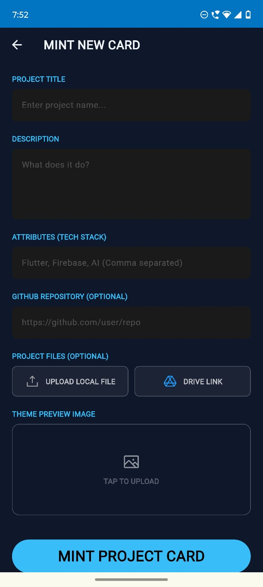
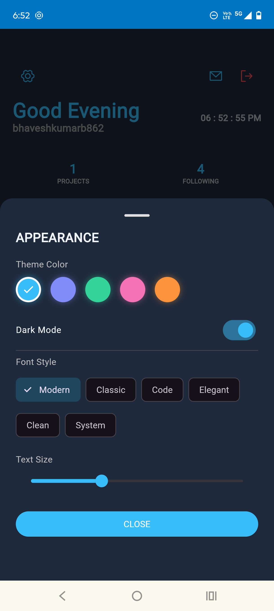
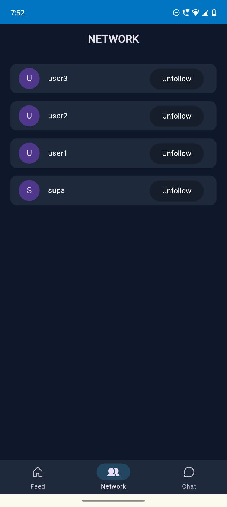

# DevDeck 
<p align="center">
  
</p>

<h1 align="center">DevDeck 🚀</h1>

DevDeck is a next-generation Project Management Portal designed to gamify the developer experience. 

It bridges the gap between utility and showcase by transforming your code repositories into living digital assets. 

Built with Flutter and powered by a robust hybrid backend of Firebase and Supabase, DevDeck provides a seamless ecosystem where project milestones translate into visual rewards.

# 📸 Snapshots

(Place screenshots of your app here: Login Screen, Feed, Project Detail, Chat)
## 📸 App Screenshots

<p align="center">
  
  
  
  
  
</p>

<p align="center">
  <b>Login</b> &nbsp;&nbsp;
  <b>Feed</b> &nbsp;&nbsp;
  <b>Mint</b> &nbsp;&nbsp;
  <b>Customize</b> &nbsp;&nbsp;
  <b>Network</b>
</p>


# 🃏 The DevDeck Card System: Evolution & Rarity

At the heart of DevDeck is the Dynamic Card Engine. Unlike static portfolios, projects in DevDeck are "Minted" as cards that evolve based on Boosts (Activity, Commits, and Community Engagement).

# The 3 Tiers of Evolution

Your project card changes color and visual style as it levels up:

## ⚪ Common (Grey)

Level: Starter (0 - 10 Boosts)

Description: The foundation. Every new project begins here as a standard entry in the deck.

## 🔵 Rare (Blue)

Level: Established (11 - 50 Boosts)

Description: Achieved by consistent updates and document uploads. The card gains a neon-blue glow, signifying an active and healthy project.

## 🟡 Mythic / Legendary (Gold)

Level: Masterpiece (50+ Boosts)

Description: The elite tier. Projects that reach high community engagement and completion status turn Gold. These cards stand out in the Global Feed with special particle effects.

## Lookup Preview 

### 🎥 Video Demo


▶️ [Click here to play the DevDeck demo](https://github.com/GSBK2006/DevDeck-APP-/blob/main/assets/video%201%20.mp4)


## How Levels Work

Levels are determined by XP (Experience Points) generated through "Boosts".

### Minting: +10 Boosts

### Uploading Files: +5 Boosts per resource

### Community Likes: +1 Boost per like

### Updates: +2 Boosts per log entry


# 🧠 Core Workflow (3-Level Architecture)

DevDeck operates on a streamlined three-tier architecture to ensure performance and security.

## Level 1: The Presentation Layer (Flutter UI)

The Interface: A responsive, glassmorphic UI built with Flutter that serves as the "Deck" for the user.

Role: Handles all user interactions, animations, and local state management. It renders the digital cards and provides the canvas for project minting.

## Level 2: The Logic & Security Layer (Middleware)

The Guard: Firebase Authentication acts as the secure gatekeeper, managing sessions and identity verification.

Role: Ensures that only authorized "Operators" can mint cards or access private chats. It bridges the frontend actions with backend permissions via Row-Level Security (RLS).

## Level 3: The Data & Storage Layer (Backend)

The Vault: A hybrid cloud infrastructure (Supabase/Firebase) that stores the persistent data.

## Role:

### Database: Stores user profiles, card metadata, and chat history.

### Storage: Hosts the heavy assets like project cover images and ZIP files.

### Real-time Sync: Pushes updates instantly to the Global Feed and Chat.

# ✨ Key Features

## 1. 🚀 Project Management Portal

Centralized Hub: Manage all your development ideas in one secure terminal.

Resource Locker: Attach PDFs, ZIPs, and documentation directly to your project cards.

Timeline Tracking: Keep a visual history of how your project has grown from day one.

## 2. 🛡️ Secure Hybrid Authentication

Powered by Firebase Auth: Robust email/password login and secure session management.

Seamless Sync: User profiles are instantly synchronized with Supabase for data persistence.

Privacy First: Row-Level Security (RLS) ensures data is only accessible to authorized users.

## 3. 🌍 Global Developer Feed

Interactive Timeline: Scroll through a real-time feed of projects minting across the community.

Engagement: Like projects and download resources directly from the feed.

Smart Filtering: View the latest and most popular cards at a glance.

## 4. 💬 Real-Time Chat System

Global Dev Chat: Connect instantly with other developers in a shared space.

Rich Messaging: Send text and images in real-time.

Live Updates: Powered by Cloud Firestore for instant message delivery without refreshing.

## 5. 🎨 Modern Glassmorphic UI

Aesthetic Design: Sleek, dark-themed UI with glassmorphism effects.

Responsive Layout: Optimized for a smooth experience across devices.

Animations: Fluid transitions and interactive elements using flutter_animate.

# 🛠️ Tech Stack

### Frontend: Flutter (Dart)

### Authentication: Firebase Auth

### Database: Cloud Firestore (NoSQL) & Supabase (PostgreSQL)

### Storage: Firebase Storage & Supabase Storage

### State Management: Native setState & StreamBuilder for reactive UI.

# 🚀 Getting Started

Follow these steps to run DevDeck locally.

Prerequisites

Flutter SDK: Install Flutter

Dart SDK: Included with Flutter.

Firebase Account: You need a Firebase project.

Supabase Account: You need a Supabase project.


# Installation

### Clone the Repository

git clone [https://github.com/your-username/devdeck.git](https://github.com/your-username/devdeck.git)

```bash

cd devdeck
```


### Install Dependencies

```bash
flutter pub get
```
### Configure Firebase

Create a project in Firebase Console.

Enable Authentication (Email/Password).

Enable Firestore Database and Storage.

Download google-services.json and place it in android/app/.

(For Web) Update lib/main.dart with your Firebase Web Config keys.

### Configure Supabase

Create a project in Supabase Dashboard.

Create buckets named images and files (set to Public).

Update lib/services/auth_service.dart with your Supabase URL and Anon Key.


### Run the App
```bash
flutter run
```


# 📂 Project Structure


```bash
lib/
├── main.dart               # App entry point
├── theme.dart              # Global styles & colors
├── card.dart               # Digital card widget logic
├── pages/
│   ├── login_page.dart     # Auth & onboarding
│   ├── feed_page.dart      # Main social timeline
│   ├── upload_page.dart    # Project minting interface
│   ├── chat_page.dart      # Real-time messaging
│   └── project_detail.dart # Expanded card view
assets/
├── logo.png                # App branding
└── intro.mp4               # Splash animation
```


# 🤝 Contribution

This project is a collaborative effort! We welcome contributions.

# Fork the Project

```bash
Create your Feature Branch (git checkout -b feature/AmazingFeature)
```
```bash
Commit your Changes (git commit -m 'Add some AmazingFeature)
```
```bash
Push to the Branch (git push origin feature/AmazingFeature)
```
Open a Pull Request

# 📄 License

Distributed under the MIT License. See LICENSE for more information.

# 📞 Contact

## For inquiries or collaboration, reach out to us on [LinkedIn](https://www.linkedin.com/in/g-s-bhavesh-kumar-310396249/)

# Happy Coding! 🚀
